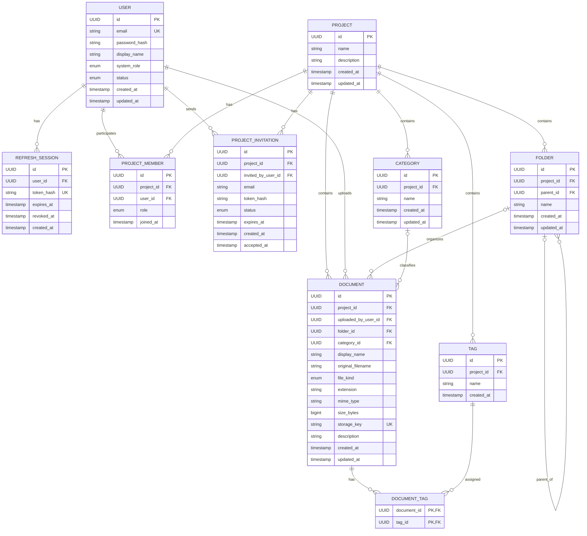

# KBase – Core v1
## Entity Analysis & ERD

**Based on:** Core KBase v1 Specification  
**Phase:** Database Conceptual Design  
**AI/RAG:** Out of scope

---

# 1. Entity Overview

Từ Core v1 Specification, hệ thống cần 10 entity chính:

```text
User
RefreshSession
Project
ProjectMember
ProjectInvitation
Folder
Category
Tag
Document
DocumentTag
```

Có thể chia thành các nhóm:

```text
Identity / Security
├── User
└── RefreshSession

Project
├── Project
├── ProjectMember
└── ProjectInvitation

Knowledge Organization
├── Folder
├── Category
└── Tag

Document Management
├── Document
└── DocumentTag
```

Không cần tạo entity riêng cho:

```text
Role
Permission
FileType
InvitationStatus
UserStatus
```

trong Core v1.

Các giá trị này phù hợp hơn với `enum`.

---

# 2. User

## Responsibility

`User` đại diện cho tài khoản của người sử dụng KBase.

Một User có thể:

- Tạo nhiều project.
- Tham gia nhiều project.
- Là OWNER của project này nhưng MEMBER của project khác.
- Upload nhiều document.
- Gửi invitation nếu là OWNER.
- Có nhiều login/refresh sessions.

## Proposed fields

```text
User
--------------------------------
id
email
password_hash
display_name
system_role
status
email_verified_at
created_at
updated_at
```

### Field analysis

| Field | Required | Description |
|---|---:|---|
| id | ✅ | UUID |
| email | ✅ | Email đăng nhập |
| password_hash | ✅ | Password đã hash |
| display_name | ✅ | Tên hiển thị |
| system_role | ✅ | ADMIN / USER |
| status | ✅ | ACTIVE / DISABLED |
| email_verified_at | ❌ | UTC timestamp; null nếu email chưa verify |
| created_at | ✅ | UTC |
| updated_at | ✅ | UTC |

## Constraints

```text
PK:
id
```

```text
UNIQUE:
email
```

Email phải được normalize trước khi lưu:

```text
Example@Mail.com

→

example@mail.com
```

## Enums

```text
SystemRole

ADMIN
USER
```

```text
UserStatus

ACTIVE
DISABLED
```

Email verification là state độc lập với UserStatus:

```text
status = ACTIVE
email_verified_at = NULL
→ account chưa được login
```

Sau khi OTP verify thành công:

```text
email_verified_at = current UTC time
```

OTP không được model thành JPA/PostgreSQL entity. OTP verification state ngắn hạn nằm trong Redis với TTL.

---

# 3. RefreshSession

## Responsibility

Entity này phục vụ:

```text
JWT Refresh Token
Logout
Refresh session revocation
```

Nếu chỉ phát JWT mà không lưu trạng thái refresh token phía server thì việc logout/invalidate refresh token sẽ khó kiểm soát.

Do đó Core v1 nên có:

```text
RefreshSession
```

thay vì lưu refresh token trực tiếp vào `User`.

## Proposed fields

```text
RefreshSession
--------------------------------
id
user_id
token_hash
expires_at
revoked_at
created_at
```

| Field | Required | Description |
|---|---:|---|
| id | ✅ | UUID |
| user_id | ✅ | User sở hữu session |
| token_hash | ✅ | Hash của refresh token |
| expires_at | ✅ | Expiration |
| revoked_at | ❌ | Null nếu active |
| created_at | ✅ | Session creation |

Không lưu raw refresh token trong database.

Flow:

```text
Client

raw refresh token
      ↓
HttpOnly Cookie
```

```text
Database

hash(refresh token)
```

Khi refresh:

```text
raw token
   ↓
hash
   ↓
compare DB
```

## Relationship

```text
User 1 ───── N RefreshSession
```

Một user có thể login trên nhiều browser/device.

RefreshSession vẫn là PostgreSQL entity. Redis **không** thay thế `refresh_sessions`; Redis trong Core v1 chỉ phục vụ email verification OTP state ngắn hạn.

---

## Email Verification OTP – Redis Boundary

OTP verification không làm tăng số lượng persistent entities/tables.

Conceptual Redis state:

```text
kbase:otp:email-verification:{userId}
    otp_hash
    attempts
    TTL

kbase:otp:email-verification:cooldown:{userId}
    TTL
```

Baseline configurable:

```text
OTP: 6 digits
TTL: 5 minutes
Resend cooldown: 60 seconds
Max attempts: 5
```

Raw OTP chỉ tồn tại đủ lâu để gửi qua Gmail SMTP và không được lưu vào PostgreSQL/log.

---

# 4. Project

## Responsibility

`Project` là security boundary và knowledge workspace chính.

Mọi:

```text
Folder
Category
Tag
Document
Member
Invitation
```

đều thuộc một Project.

## Proposed fields

```text
Project
--------------------------------
id
name
description
created_at
updated_at
```

Không cần:

```text
owner_id
```

trực tiếp trong Project.

Ownership được xác định bằng:

```text
ProjectMember.role = OWNER
```

Việc lưu đồng thời:

```text
Project.owner_id
+
ProjectMember OWNER
```

sẽ gây duplicate source of truth.

Vì vậy không nên làm.

---

# 5. ProjectMember

Đây là một trong những entity quan trọng nhất.

## Responsibility

Giải quyết quan hệ:

```text
User N ───── N Project
```

và đồng thời lưu role của user trong từng project.

## Proposed fields

```text
ProjectMember
--------------------------------
id
project_id
user_id
role
joined_at
```

| Field | Required |
|---|---:|
| id | ✅ |
| project_id | ✅ |
| user_id | ✅ |
| role | ✅ |
| joined_at | ✅ |

## Enum

```text
ProjectRole

OWNER
MEMBER
```

## Constraints

```text
UNIQUE(project_id, user_id)
```

Một user chỉ có thể xuất hiện một lần trong một project.

Sai:

```text
Project A
User X
OWNER
```

và:

```text
Project A
User X
MEMBER
```

đồng thời.

---

# 6. Owner Constraint

Mỗi project trong Core v1:

```text
exactly 1 OWNER
```

Conceptually:

```text
Project
  │
  ├── OWNER × 1
  │
  ├── MEMBER
  ├── MEMBER
  └── MEMBER
```

Ở PostgreSQL sau này có thể dùng partial unique constraint/index để đảm bảo:

```text
at most one OWNER per project
```

Ví dụ về ý tưởng:

```text
UNIQUE project_id
WHERE role = 'OWNER'
```

Còn việc đảm bảo:

```text
at least one OWNER
```

sẽ được đảm bảo bởi business transaction khi tạo project.

Project creation phải atomic:

```text
BEGIN

INSERT Project
INSERT ProjectMember(role = OWNER)

COMMIT
```

Không được tồn tại:

```text
Project
without OWNER
```

---

# 7. ProjectInvitation

## Responsibility

Invitation không đồng nghĩa membership.

Flow:

```text
Owner creates invitation
        ↓
ProjectInvitation
        ↓
Gmail SMTP invitation email
        ↓
User accepts
        ↓
ProjectMember
```

## Proposed fields

```text
ProjectInvitation
--------------------------------
id
project_id
email
invited_by_user_id
token_hash
status
expires_at
created_at
accepted_at
```

## Enum

```text
InvitationStatus

PENDING
ACCEPTED
EXPIRED
CANCELLED
```

## Important

Nên lưu:

```text
token_hash
```

thay vì raw invitation token.

Email link chứa raw token:

```text
/invitations/{rawToken}
```

Database lưu:

```text
hash(rawToken)
```

Invitation vẫn dùng secure invitation link/token. OTP không thay thế invitation token. Nếu recipient chưa có account, họ register + verify email bằng OTP trước, sau đó login và accept invitation.

---

# 8. ProjectInvitation Constraints

Không cho:

```text
same project
+
same email
+
multiple PENDING invitations
```

Conceptually:

```text
UNIQUE active invitation:

(project_id, normalized_email)
WHERE status = PENDING
```

Ví dụ:

```text
Project A
user@example.com
PENDING
```

Owner resend thì:

```text
invalidate old token
generate new token
reset expires_at
```

không tạo thêm một invitation PENDING thứ hai.

---

# 9. Folder

## Responsibility

Folder cung cấp hierarchical document organization.

Ví dụ:

```text
Backend
├── API
├── Database
└── Security
```

## Proposed fields

```text
Folder
--------------------------------
id
project_id
parent_id
name
created_at
updated_at
```

`parent_id`:

```text
nullable
```

Nếu null:

```text
root-level folder
```

---

# 10. Folder Self Relationship

Folder có self-reference:

```text
Folder
  │
  └──── parent Folder
```

Conceptually:

```text
Folder 1 ───── N Folder
```

Ví dụ:

```text
Backend
    ↓
Security
    ↓
JWT
```

---

# 11. Folder Business Constraints

Folder parent phải thuộc cùng project.

Không được:

```text
Project A / Folder A
        ↓
parent =
Project B / Folder B
```

Ngoài ra phải prevent cycle:

```text
A
└── B
    └── C
```

không được move:

```text
A → C
```

vì sẽ tạo:

```text
A → B → C → A
```

---

# 12. Folder Name Uniqueness

Tên folder chỉ cần unique trong:

```text
same parent
+
same project
```

Ví dụ hợp lệ:

```text
Project

Backend
└── Specs

Frontend
└── Specs
```

Hai folder `Specs` có parent khác nhau nên hợp lệ.

Không hợp lệ:

```text
Backend
├── Specs
└── specs
```

Tên được so sánh case-insensitive.

---

# 13. Category

## Responsibility

Category dùng để biểu diễn business classification.

Ví dụ:

```text
Requirement
Technical
Meeting Note
Design
Guide
```

## Proposed fields

```text
Category
--------------------------------
id
project_id
name
created_at
updated_at
```

Relationship:

```text
Project 1 ───── N Category
```

---

# 14. Category Constraints

Trong cùng project:

```text
Category.name
```

phải unique case-insensitive.

Ví dụ không được:

```text
Technical
technical
TECHNICAL
```

cùng tồn tại trong một project.

---

# 15. Category ↔ Document

Một document:

```text
0..1 Category
```

Một category:

```text
0..N Documents
```

Do đó:

```text
Category 1 ───── N Document
```

với `category_id` nullable ở Document.

Không cần junction table.

---

# 16. Tag

## Responsibility

Tag cung cấp flexible labeling.

Ví dụ:

```text
jwt
security
spring-boot
urgent
sprint-4
```

## Proposed fields

```text
Tag
--------------------------------
id
project_id
name
created_at
```

Relationship:

```text
Project 1 ───── N Tag
```

Tag name unique case-insensitive trong project.

---

# 17. Document ↔ Tag

Một Document:

```text
0..N Tags
```

Một Tag:

```text
0..N Documents
```

Đây là:

```text
N : N
```

Do đó cần:

```text
DocumentTag
```

---

# 18. DocumentTag

Pure junction entity:

```text
DocumentTag
--------------------------------
document_id
tag_id
```

Primary key có thể dùng:

```text
(document_id, tag_id)
```

Không nhất thiết cần UUID riêng.

Điều này đảm bảo:

```text
same tag
```

không được attach hai lần vào cùng document.

---

# 19. Document

Đây là entity trung tâm của phần Knowledge Base.

Tên `Document` trong Core v1 đại diện cho mọi uploaded resource:

```text
PDF
Word
Excel
PowerPoint
Text
Image
Video
```

Không chỉ literal document.

---

# 20. Document Proposed Fields

```text
Document
--------------------------------
id

project_id
uploaded_by_user_id

folder_id
category_id

display_name
original_filename

file_kind
extension
mime_type
size_bytes

storage_key

description

created_at
updated_at
```

---

# 21. Document Field Analysis

| Field | Required | Meaning |
|---|---:|---|
| id | ✅ | UUID |
| project_id | ✅ | Project owner |
| uploaded_by_user_id | ✅ | Người upload |
| folder_id | ❌ | Folder |
| category_id | ❌ | Category |
| display_name | ✅ | Tên hiển thị |
| original_filename | ✅ | Tên file lúc upload |
| file_kind | ✅ | DOCUMENT / IMAGE / VIDEO |
| extension | ✅ | pdf, docx... |
| mime_type | ✅ | MIME detected |
| size_bytes | ✅ | File size |
| storage_key | ✅ | MinIO object key |
| description | ❌ | User description |
| created_at | ✅ | Upload time |
| updated_at | ✅ | Last metadata change |

---

# 22. FileKind

Không cần entity riêng.

Enum:

```text
FileKind

DOCUMENT
IMAGE
VIDEO
```

Extension vẫn được lưu riêng.

Ví dụ:

```text
file_kind = DOCUMENT
extension = pdf
```

hoặc:

```text
file_kind = VIDEO
extension = mp4
```

---

# 23. Original Filename vs Display Name

Hai field này không giống nhau.

Ví dụ user upload:

```text
meeting_16092026_final_v2.pdf
```

Database:

```text
original_filename
=
meeting_16092026_final_v2.pdf
```

Sau đó user rename trên KBase:

```text
display_name
=
Sprint Planning Notes.pdf
```

MinIO vẫn giữ:

```text
storage_key
=
projects/.../550e8400....pdf
```

Rename không cần rename MinIO object.

---

# 24. Storage Key

`storage_key` phải unique.

Ví dụ:

```text
projects/
  {projectId}/
    documents/
      {documentId}.pdf
```

Không sử dụng trực tiếp:

```text
original_filename
```

làm storage key.

Lợi ích:

- Tránh filename collision.
- Tránh unsafe paths.
- Rename không ảnh hưởng MinIO.
- Dễ xác định ownership.
- Không expose tên file gốc trong storage structure.

---

# 25. Document ↔ User

Relationship:

```text
User 1 ───── N Document
```

qua:

```text
uploaded_by_user_id
```

Field này rất quan trọng vì permission của MEMBER dựa trên:

```text
document.uploaded_by_user_id
==
authenticated_user.id
```

---

# 26. Document ↔ Project

```text
Project 1 ───── N Document
```

`project_id` bắt buộc.

Document không thể tồn tại ngoài project.

---

# 27. Document ↔ Folder

```text
Folder 1 ───── N Document
```

nhưng Document có thể không nằm trong folder:

```text
folder_id = NULL
```

tương đương:

```text
Project root
```

---

# 28. Document ↔ Category

```text
Category 1 ───── N Document
```

nhưng:

```text
category_id = NULL
```

được phép.

---

# 29. Cross-Project Integrity

Đây là rule cực kỳ quan trọng.

Giả sử:

```text
Document.project_id = Project A
```

thì:

```text
folder_id
category_id
tags
```

tất cả phải thuộc:

```text
Project A
```

Không được:

```text
Document → Project A
Folder   → Project B
```

hoặc:

```text
Document → Project A
Tag      → Project C
```

Các rule này phải được backend validate.

---

# 30. Why No Permission Entity?

Không cần entity:

```text
Permission
RolePermission
DocumentPermission
```

trong Core v1.

Permission hiện tại có thể derive hoàn toàn từ:

```text
User.system_role

ProjectMember.role

Document.uploaded_by_user_id
```

Ví dụ:

```text
Can delete document?
```

logic:

```text
ADMIN
    → YES

OWNER of document.project
    → YES

MEMBER
AND document.uploadedBy == currentUser
    → YES

otherwise
    → NO
```

Việc thêm RBAC tables lúc này chỉ làm database phức tạp mà không mang thêm functionality cần thiết.

---

# 31. Why No File Entity?

Không cần:

```text
Document
   ↓
File
```

ở Core v1.

Một Document tương ứng đúng một binary object.

Do đó:

```text
Document.storage_key
```

là đủ.

Sau này nếu có:

```text
Versioning
```

có thể refactor thành:

```text
Document
    ↓
DocumentVersion
        ↓
Storage Object
```

nhưng chưa cần cho v1.

---

# 32. Why No Owner Field in Project?

Không nên:

```text
Project
----------------
owner_id
```

đồng thời với:

```text
ProjectMember
----------------
role = OWNER
```

vì sẽ có nguy cơ:

```text
Project.owner_id = User A
```

nhưng:

```text
ProjectMember
User B = OWNER
```

Hai source of truth mâu thuẫn nhau.

Core v1 chỉ dùng:

```text
ProjectMember.role
```

làm source of truth duy nhất.

---

# 33. Main Relationship Summary

| Entity A | Relationship | Entity B |
|---|---|---|
| User | 1:N | RefreshSession |
| User | N:N | Project |
| User | 1:N | Document |
| User | 1:N | ProjectInvitation as inviter |
| Project | 1:N | ProjectMember |
| Project | 1:N | ProjectInvitation |
| Project | 1:N | Folder |
| Project | 1:N | Category |
| Project | 1:N | Tag |
| Project | 1:N | Document |
| Folder | 1:N | Folder |
| Folder | 1:N | Document |
| Category | 1:N | Document |
| Document | N:N | Tag |
| Document | 1:N | DocumentTag |
| Tag | 1:N | DocumentTag |

---

# 34. Conceptual ERD

```text
                           ┌───────────────────┐
                           │       USER        │
                           │───────────────────│
                           │ id                │
                           │ email             │
                           │ password_hash     │
                           │ display_name      │
                           │ system_role       │
                           │ status            │
                           └───────┬───────────┘
                                   │
                      1            │            1
                  ┌────────────────┼────────────────┐
                  │                │                │
                  ▼ N              ▼ N              ▼ N
       ┌─────────────────┐ ┌────────────────┐ ┌───────────────────┐
       │ REFRESH_SESSION │ │ PROJECT_MEMBER │ │ PROJECT_INVITATION│
       └─────────────────┘ │────────────────│ │───────────────────│
                           │ project_id     │ │ project_id        │
                           │ user_id        │ │ email             │
                           │ role           │ │ invited_by        │
                           └───────┬────────┘ │ token_hash        │
                                   │          │ status            │
                                   │          └─────────┬─────────┘
                                   │                    │
                                   │ N                  │ N
                                   ▼                    ▼
                         ┌───────────────────────────────┐
                         │            PROJECT            │
                         │───────────────────────────────│
                         │ id                            │
                         │ name                          │
                         │ description                   │
                         └──────────────┬────────────────┘
                                        │
             ┌──────────────┬───────────┼────────────┬──────────────┐
             │              │           │            │              │
             ▼              ▼           ▼            ▼              ▼
        ┌─────────┐   ┌──────────┐ ┌────────┐  ┌──────────┐   ┌──────────┐
        │ FOLDER  │   │ CATEGORY │ │  TAG   │  │ DOCUMENT │   │INVITATION│
        └────┬────┘   └────┬─────┘ └───┬────┘  └────┬─────┘   └──────────┘
             │             │           │            │
             │ parent      │           │            │
             └─────┐       │           │            │
                   │       │           │            │
                   ▼       │           │            │
                FOLDER     │           │            │
                           │           │            │
                           └──────────► DOCUMENT ◄──┘
                                       │
                                       │ N
                                       ▼
                                ┌──────────────┐
                                │ DOCUMENT_TAG │
                                └──────┬───────┘
                                       │ N
                                       ▼
                                      TAG
```

---

# 35. Cleaner Logical ERD

```text
USER
│
├──< REFRESH_SESSION
│
├──< PROJECT_MEMBER >── PROJECT
│                         │
│                         ├──< PROJECT_INVITATION
│                         │
│                         ├──< FOLDER
│                         │     │
│                         │     └──< FOLDER
│                         │
│                         ├──< CATEGORY
│                         │
│                         ├──< TAG
│                         │
│                         └──< DOCUMENT
│                                │
│                                ├──── FOLDER?
│                                │
│                                ├──── CATEGORY?
│                                │
│                                └──< DOCUMENT_TAG >── TAG
│
├──< DOCUMENT
│     uploaded_by
│
└──< PROJECT_INVITATION
      invited_by
```

`?` nghĩa là nullable/optional relationship.

---

# 36. Mermaid ERD Representation



---

# 37. Candidate Primary Keys

| Entity | PK |
|---|---|
| User | UUID |
| RefreshSession | UUID |
| Project | UUID |
| ProjectMember | UUID |
| ProjectInvitation | UUID |
| Folder | UUID |
| Category | UUID |
| Tag | UUID |
| Document | UUID |
| DocumentTag | `(document_id, tag_id)` |

UUID phù hợp vì:

- IDs không dễ đoán.
- Thích hợp cho REST API.
- Thích hợp distributed systems.
- Không expose sequence như `1,2,3...`.
- Sau này dễ mở rộng service.

---

# 38. Important Unique Constraints

```text
User
UNIQUE(email)
```

```text
ProjectMember
UNIQUE(project_id, user_id)
```

```text
Folder
UNIQUE(project_id, parent_id, lower(name))
```

về mặt business.

```text
Category
UNIQUE(project_id, lower(name))
```

```text
Tag
UNIQUE(project_id, lower(name))
```

```text
Document
UNIQUE(storage_key)
```

```text
DocumentTag
PRIMARY KEY(document_id, tag_id)
```

```text
ProjectInvitation

max 1 PENDING invitation
per project + email
```

---

# 39. Foreign Key Overview

```text
RefreshSession.user_id
→ User.id
```

```text
ProjectMember.user_id
→ User.id
```

```text
ProjectMember.project_id
→ Project.id
```

```text
ProjectInvitation.project_id
→ Project.id
```

```text
ProjectInvitation.invited_by_user_id
→ User.id
```

```text
Folder.project_id
→ Project.id
```

```text
Folder.parent_id
→ Folder.id
```

```text
Category.project_id
→ Project.id
```

```text
Tag.project_id
→ Project.id
```

```text
Document.project_id
→ Project.id
```

```text
Document.uploaded_by_user_id
→ User.id
```

```text
Document.folder_id
→ Folder.id
```

```text
Document.category_id
→ Category.id
```

```text
DocumentTag.document_id
→ Document.id
```

```text
DocumentTag.tag_id
→ Tag.id
```

---

# 40. Project Hard Delete

Project deletion có ảnh hưởng lớn nhất.

Nếu:

```text
DELETE Project
```

DB-side resources phải được xóa:

```text
ProjectMember
ProjectInvitation
Folder
Category
Tag
DocumentTag
Document
```

Nhưng MinIO không nằm trong PostgreSQL transaction.

Do đó không được dựa hoàn toàn vào:

```text
ON DELETE CASCADE
```

cho toàn bộ project deletion flow.

Application service phải orchestration:

```text
Owner requests project deletion
             ↓
Authorization
             ↓
Find project documents
             ↓
Delete MinIO objects
             ↓
Delete relational data
             ↓
Delete Project
```

Nếu xảy ra failure phải có compensation/retry strategy ở implementation phase.

---

# 41. Document Hard Delete

Document delete:

```text
Document
   │
   └── DocumentTag
```

`DocumentTag` có thể:

```text
ON DELETE CASCADE
```

Nhưng MinIO object phải được xử lý bởi application service.

```text
Delete request
     ↓
authorization
     ↓
MinIO object delete
     ↓
Document delete
     ↓
DocumentTag cascade
```

---

# 42. Folder Delete

Đã chốt:

```text
Folder only deletable when empty
```

Do đó không nên:

```text
ON DELETE CASCADE
```

từ Folder sang:

```text
Document
Subfolder
```

Nếu folder còn content:

```text
409 Conflict
```

---

# 43. Category Delete

Đã chốt:

```text
Category cannot be deleted
while documents use it
```

Do đó relationship:

```text
Category → Document
```

nên dùng behavior tương đương:

```text
RESTRICT
```

không:

```text
CASCADE
```

---

# 44. Tag Delete

Tag khác Category.

Đã chốt:

```text
Delete Tag
```

sẽ:

```text
delete DocumentTag
```

nhưng:

```text
keep Document
```

Do đó:

```text
Tag
 ↓
DocumentTag

CASCADE
```

là hợp lý.

---

# 45. User Delete

User hard delete cần thận trọng.

User có thể đang:

```text
OWNER of Project
Uploader of Document
Inviter
Member
RefreshSession owner
```

Core v1 specification đã quy định:

```text
User cannot be deleted
when unresolved dependencies exist.
```

Vì vậy không nên cascade toàn bộ dữ liệu của user một cách âm thầm.

Ví dụ tuyệt đối không nên:

```text
DELETE User

→ automatically delete
all Documents uploaded by that user
```

vì tài liệu thuộc Knowledge Base của team chứ không nhất thiết thuộc riêng người upload.

V1 nên ưu tiên:

```text
DISABLE USER
```

thay vì hard delete nếu vẫn còn project data.

---

# 46. Newly Identified Business Rule

Trong quá trình thiết kế ERD xuất hiện một trường hợp **chưa được chốt trong Specification trước**, nên không nên tự âm thầm quyết định:

```text
What happens to uploaded documents
when a MEMBER leaves
or OWNER removes that MEMBER?
```

Ví dụ:

```text
Project A

User B uploads:
- API Specification.pdf
- Meeting Notes.pdf
```

sau đó:

```text
User B leaves Project A
```

Có hai hướng:

### Option A — Delete user's documents

```text
Member leaves
     ↓
Delete their files
```

Nhược điểm:

- Làm mất team knowledge.
- Một user rời team có thể khiến project mất hàng loạt tài liệu.
- Không phù hợp Knowledge Base.

### Option B — Keep documents

```text
Member leaves
     ↓
Documents remain
     ↓
uploaded_by remains User B
     ↓
OWNER manages them afterward
```

Đây là hướng phù hợp hơn với mục tiêu KBase.

**Recommendation cho Core v1:**

```text
Remove/leave member
DOES NOT delete documents.
```

Document vẫn giữ uploader để biết nguồn gốc.

Sau khi user không còn membership:

```text
User B
→ cannot access those documents anymore

Project OWNER
→ retains full management rights
```

Đây là rule mới cần được đưa trở lại Core Specification nếu được chấp nhận.

---

# 47. Another Important Implication

Do documents tồn tại độc lập với membership:

```text
Document.uploaded_by_user_id
```

phải reference:

```text
User
```

chứ không nên reference:

```text
ProjectMember
```

Nếu Document reference ProjectMember:

```text
Member leaves
→ ProjectMember deleted
→ Document FK breaks
```

Do đó thiết kế đúng hơn là:

```text
Document
   ├── project_id → Project
   └── uploaded_by_user_id → User
```

Permission hiện tại được kiểm tra bằng:

```text
current ProjectMember
+
Document.uploadedBy
```

---

# 48. Entity Count

Core v1 cuối cùng hiện có:

```text
10 entities
```

### Security

```text
1. User
2. RefreshSession
```

### Project

```text
3. Project
4. ProjectMember
5. ProjectInvitation
```

### Organization

```text
6. Folder
7. Category
8. Tag
```

### File

```text
9. Document
10. DocumentTag
```

Không có entity nào trong danh sách hiện tại chỉ phục vụ AI.

Email verification OTP cũng không tạo entity/table mới vì OTP state nằm trong Redis và có TTL. Persistent verification result được giữ trong `users.email_verified_at`.

---

# 49. Entities Reserved for Future AI Phase

Sau này mới có thể bổ sung:

```text
DocumentChunk
Embedding
ChatSession
ChatMessage
AIProcessingJob
VideoTranscript
```

Ví dụ:

```text
Document
    ↓
DocumentChunk
    ↓
Embedding
```

Nhưng không đưa vào database Core v1 hiện tại.

---

# 50. Recommended ERD Baseline

ERD baseline cho bước database schema:

```text
USER
 ├── REFRESH_SESSION
 ├── PROJECT_MEMBER ───── PROJECT
 ├── PROJECT_INVITATION ─ PROJECT
 └── DOCUMENT
                         │
PROJECT ─────────────────┤
 ├── PROJECT_MEMBER      │
 ├── PROJECT_INVITATION  │
 ├── FOLDER ── FOLDER    │
 ├── CATEGORY ─────────── DOCUMENT
 ├── TAG ─ DOCUMENT_TAG ─ DOCUMENT
 └─────────────────────── DOCUMENT
```

Đây là conceptual/logical ERD chính thức để chuyển sang Physical Database Design sau khi business rule về **member rời project nhưng để lại documents** được xác nhận.

Redis OTP store và Gmail SMTP là external infrastructure boundaries nên không được biểu diễn như relational entity trong ERD này.